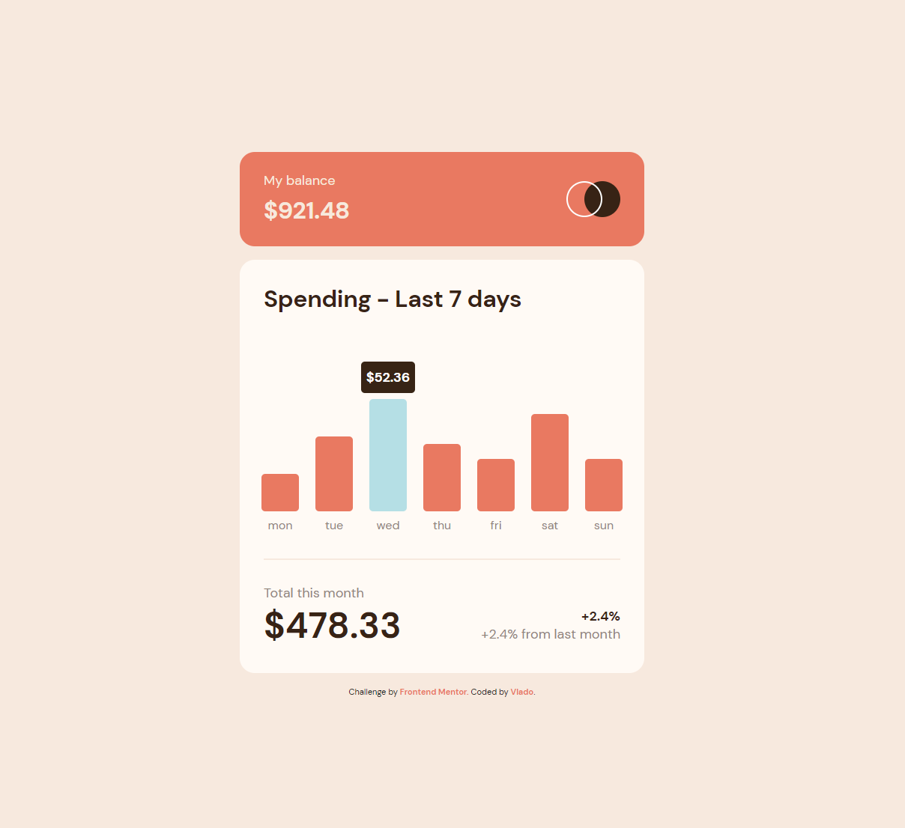

# Frontend Mentor - Expenses chart component solution

This is a solution to the [Expenses chart component challenge on Frontend Mentor](https://www.frontendmentor.io/challenges/expenses-chart-component-e7yJBUdjwt). Frontend Mentor challenges help you improve your coding skills by building realistic projects. 

## Table of contents

- [Overview](#overview)
  - [The challenge](#the-challenge)
  - [Screenshot](#screenshot)
  - [Links](#links)
- [My process](#my-process)
  - [Built with](#built-with)
  - [What I learned](#what-i-learned)
- [Author](#author)

## Overview

### The challenge

Users should be able to:

- Desktop first design and development
- View the bar chart and hover over the individual bars to see the correct amounts for each day
- See the current day’s bar highlighted in a different colour to the other bars
- See hover states for all interactive elements on the page

### Screenshot

### Links

- Solution URL: [Add solution URL here](https://your-solution-url.com)
- Live Site URL: [Add live site URL here](https://spectacular-daifuku-172c13.netlify.app)

## My process

### Built with

- Semantic HTML5 markup
- CSS custom properties
- Flexbox
- Desktop-first workflow

### What I learned

I had so much fun doing this challenge. First step was to recreate the design in Figma by looking at the screenshot. After that I coded everything in VSCode.
I implemented JavaScript code for the hover states for all interactive elements on the page. This was a great practice for HTML, CSS and JavaScript challenge!

## Author

- Website - [Vlado](https://dovla.me)
- Frontend Mentor - [@D0vl4](https://www.frontendmentor.io/profile/D0vl4)
- GitHub profile - [Vlado](https://github.com/D0vl4)
